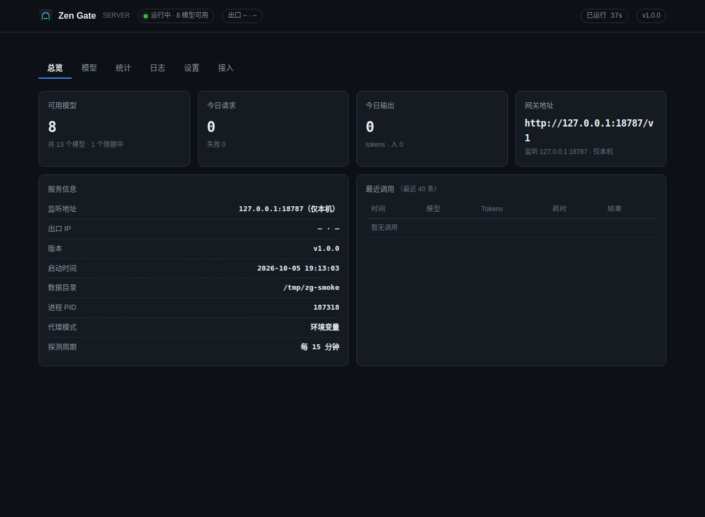
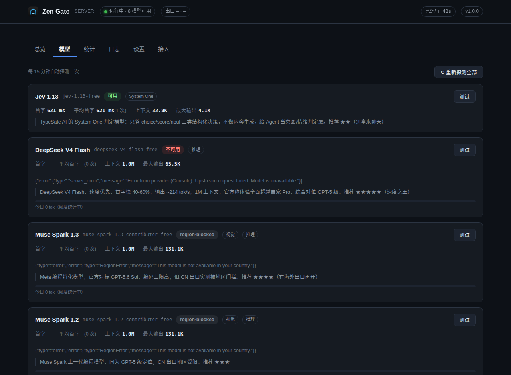

# Zen Gate Server

> **把 OpenCode Zen 免费模型装进你所有的 AI Agent —— Linux 服务端版，带 WebUI。**

在原 [zen-gate](https://github.com/LAGcomcom/zen-gate)（Windows 托盘程序）基础上重写的 **Linux 无头服务端**：
单二进制、systemd 友好、Docker 就绪，用浏览器管理，不做任何桌面依赖。

在服务器上把 OpenCode Zen 免费车道封装成**标准 OpenAI / Anthropic / Responses 兼容接口**，
任何支持自定义 base_url 的客户端都能直接接入。

---

## 与原版的区别

| | 原版（Windows 托盘） | 本版（Linux 服务端） |
|---|---|---|
| 运行形态 | 桌面托盘 + WebView2 窗口 | 无头服务 + 浏览器 WebUI |
| 监听地址 | 强制 127.0.0.1 | 可配（默认回环，可绑 0.0.0.0 供局域网/容器） |
| 配置注入 | 自动探测并改写本机 10+ Agent 配置 | 不做（服务端不碰客户端），提供各客户端接入示例 |
| 系统代理 | 读 Windows 注册表 WinINET | 读 gsettings / KDE，或环境变量 |
| 数据目录 | `%APPDATA%\zen-gate` | `$XDG_DATA_HOME/zen-gate` |
| 更新机制 | 自更新二进制 | 交给包管理 / systemd / Docker 镜像 |
| 认证 | 仅回环护栏 | API Key（`/v1`）+ WebUI 密码（管理页） |
| 协议核心 | — | **完全一致**（移植自同一 MIT 参考实现） |

---

## 功能

- 🔄 **限流自动切换**：模型被限流时自动换下一个可用模型接住请求，响应头 `x-zen-gate-served-by` 标注实际服务模型
- 🧬 **协议完整移植**：会话铸造、指纹门（tools 四元组）、三种线协议（chat / responses / messages）、纯思考断流恢复、DSML 控制标记清洗
- 📊 **额度测算**：无官方余额 API 也能估——限额时段追踪 + 恢复时间预估 + 日额度进度条
- ⏱ **首字历史**：每次探测的首字延迟入样本环，重启不丢，模型页直接看平均首字
- 🌡 **GitHub 式热力图**：17 周用量热力图 + 30 天趋势柱状图 + 模型用量占比
- 🩺 **单模型体检**：每个模型可单独探测可用性与首字延迟
- 🌐 **代理支持**：环境变量 / 直连 / 系统代理 / 自定义，内置连通性测试（含出口 IP 与地区）
- 🖥 **完整 WebUI**：总览、模型、统计、日志、设置、接入 六个页面，实时轮询 + 一键复制配置片段
- 🐳 **零依赖部署**：纯 Go 标准库，无 CGO，单文件二进制

---

## 快速开始

### 0. 获取代码

```bash
git clone https://github.com/sanhe458/zen-gate-server.git
cd zen-gate-server
```

或从 [Releases](https://github.com/sanhe458/zen-gate-server/releases) 直接下载预编译二进制：

```bash
# linux/amd64
curl -L -o zen-gate-server https://github.com/sanhe458/zen-gate-server/releases/latest/download/zen-gate-server-linux-amd64
chmod +x zen-gate-server && ./zen-gate-server
```

### 1. 构建

```bash
make build            # → dist/zen-gate-server
# 或交叉编译 linux/amd64 + linux/arm64：
make release
```

需要 Go 1.25+（纯标准库，无第三方依赖）。

### 2. 运行

```bash
# 前台调试（仅本机可访问）
./dist/zen-gate-server

# 指定端口与数据目录
./dist/zen-gate-server -port 8787 -data /var/lib/zen-gate
```

启动后：

- **API**：`http://127.0.0.1:8787/v1`
- **WebUI**：`http://127.0.0.1:8787/`（或 `/admin`）
- **主 API Key**：首次启动自动生成 `ofm-…`，在 WebUI「设置 → API Key」查看或轮换

### 3. 命令行参数

| 参数 | 说明 |
|---|---|
| `-host` | 监听地址。默认 `127.0.0.1`；`0.0.0.0` 暴露局域网 |
| `-port` | 监听端口，默认 8787 |
| `-data` | 数据目录，默认 `$ZEN_GATE_HOME` 或 `~/.local/share/zen-gate` |
| `-password` | 设置 WebUI 密码（远程访问管理页必需） |
| `-version` | 打印版本退出 |

环境变量：`ZEN_GATE_HOME`（数据目录）、`http_proxy` / `https_proxy`（代理模式下生效）。

---

## 部署

### systemd

```bash
sudo useradd -r -s /usr/sbin/nologin zen-gate
sudo mkdir -p /var/lib/zen-gate && sudo chown zen-gate:zen-gate /var/lib/zen-gate
sudo install -m755 dist/zen-gate-server /usr/local/bin/zen-gate-server
sudo cp deploy/zen-gate-server.service /etc/systemd/system/
sudo systemctl daemon-reload
sudo systemctl enable --now zen-gate-server
journalctl -u zen-gate-server -f
```

### Docker

```bash
docker build -t zen-gate-server -f deploy/Dockerfile .
docker run -d --name zen-gate -p 127.0.0.1:8787:8787 \
  -v zen-gate-data:/data zen-gate-server
```

### 开放局域网 / 远程管理

服务端默认只监听回环。要让同网段其他机器使用：

1. WebUI「设置 → 监听与安全」把监听地址改为 `0.0.0.0`，**设置 WebUI 密码**，保存后重启服务；
2. 或用命令行：`zen-gate-server -host 0.0.0.0 -password 'your-strong-password'`。

> ⚠️ 绑定 `0.0.0.0` 且未设密码时：`/v1` API 仍受 API Key 保护，但**管理页会拒绝非本机访问**（安全默认）。

---

## WebUI

六个页面，全部走 `/admin/api/*`，回环调用免密、远程调用需会话 cookie。




| 页面 | 内容 |
|---|---|
| **总览** | 可用模型数、今日请求/输出、网关地址、出口 IP 与地区、服务信息、最近 40 条调用记录 |
| **模型** | 每模型状态徽章（可用/已限额/地区受限）、首字与平均首字、上下文与输出上限、社区简介、额度进度条、单模型「测试」按钮 |
| **统计** | 近 30 天请求量与输出 Tokens 柱状图、模型用量占比、17 周用量热力图、CSV 导出 |
| **日志** | 内存环形缓冲（最近 1000 条），按级别过滤，可自动刷新 |
| **设置** | 默认输出预算 / 思考力度 / 探测间隔 / 限流切换 / 地区信息；代理模式与连通性测试；监听端口地址与 WebUI 密码；API Key 轮换；配置导入导出 |
| **接入** | 连接信息 + 各客户端可直接复制的配置片段（curl / Python / Claude Code / Codex / OpenCode）与模型速查表 |

---

## 接入示例

把 `<BASE>` 换成 `http://127.0.0.1:8787/v1`，`<KEY>` 换成你的主 Key。

### OpenAI Chat Completions

```bash
curl <BASE>/chat/completions \
  -H "Authorization: Bearer <KEY>" \
  -H "Content-Type: application/json" \
  -d '{"model":"mimo-v2.6-flash-free","messages":[{"role":"user","content":"你好"}],"stream":true}'
```

```python
from openai import OpenAI
client = OpenAI(base_url="<BASE>", api_key="<KEY>")
r = client.chat.completions.create(model="mimo-v2.6-flash-free",
                                   messages=[{"role":"user","content":"hello"}])
print(r.choices[0].message.content)
```

### Anthropic Messages（Claude 协议）

```bash
curl <BASE>/messages \
  -H "x-api-key: <KEY>" -H "anthropic-version: 2023-06-01" \
  -H "Content-Type: application/json" \
  -d '{"model":"deepseek-v4-flash-free","max_tokens":8192,
       "messages":[{"role":"user","content":"用一句话解释 TCP 拥塞控制"}]}'
```

### Claude Code

```bash
export ANTHROPIC_BASE_URL=<BASE>
export ANTHROPIC_AUTH_KEY=<KEY>
export ANTHROPIC_MODEL=mimo-v2.6-flash-free
export ANTHROPIC_SMALL_FAST_MODEL=deepseek-v4-flash-free
claude
```

### Codex CLI

```toml
# ~/.codex/config.toml
model_provider = "zen_gate"
model = "mimo-v2.6-flash-free"

[model_providers.zen_gate]
name = "Zen Gate"
base_url = "<BASE>"
wire_api = "chat"
env_key = "ZEN_GATE_API_KEY"
```

```bash
export ZEN_GATE_API_KEY=<KEY>
codex
```

### OpenCode

```json
{
  "provider": {
    "zen_gate": {
      "npm": "@ai-sdk/openai-compatible",
      "options": { "baseURL": "<BASE>", "apiKey": "<KEY>" },
      "models": { "mimo-v2.6-flash-free": {}, "deepseek-v4-flash-free": {} }
    }
  }
}
```

### 思考力度

推理模型支持在**模型名后加力度后缀**，或传 `reasoning_effort`：

- `mimo-v2.6-flash-free (light)` — 轻量，最省额度
- `mimo-v2.6-flash-free` — 均衡（默认）
- `mimo-v2.6-flash-free (deep)` — 深思

`reasoning_effort` 接受 `light|balanced|deep|medium|high|minimal|low|none|off|xhigh`。

---

## API 端点

| 方法 | 路径 | 认证 | 说明 |
|---|---|---|---|
| GET | `/health` | 否 | 健康检查（Docker HEALTHCHECK 用） |
| GET | `/v1/models` | Key | OpenAI 风格模型列表（含力度变体） |
| POST | `/v1/chat/completions` | Key | OpenAI Chat Completions（流式/非流式） |
| POST | `/v1/responses` | Key | OpenAI Responses API |
| POST | `/v1/messages` | Key | Anthropic Messages API |
| GET | `/v1/codex-catalog` | 否 | Codex 远程模型目录（非敏感，故意免认证） |
| — | `/admin` | 会话 | WebUI |
| — | `/admin/api/*` | 会话 | 管理接口（state / settings / reprobe / probe/:id / logs / usage.csv / proxy-test / key/rotate / export / import） |

`/v1/*` 支持 CORS，浏览器端应用可跨域调用。

---

## 数据目录

```
$ZEN_GATE_HOME/            (默认 ~/.local/share/zen-gate)
├── config.json            配置（含 MainKey、WebUI 密码、代理、监听地址）
├── stats.json             按天聚合的用量统计 + 最近 40 条调用
├── quota.json             各模型限额时段历史（用于恢复时间预估）
├── perf.json              各模型首字延迟样本环（30 个）
├── backups/               配置备份
└── logs/                  按天滚动的日志文件，保留 7 天
```

配置全部为原子写入（先写 `.tmp` 再 rename），损坏文件会改名保留以便排查。

---

## 工作原理

上游 OpenCode Zen 免费车道没有标准 API Key 体系，一般客户端接不上。本服务在本机把这条车道封装成标准接口，关键点：

1. **会话铸造**：上游按 session 计额度，同一会话必须落在同一 session id 上（跨重启也稳定），否则会迅速触发 429；
2. **指纹门**：免费层要求 `tools` 中声明 `bash` / `glob` / `grep` / `read` 四个小写工具名。已有真实工具会被就地规范命名，没有的用 `pwsh→bash` 之类真实工具顶替，其余填自禁用占位；返回时再还原成调用方的原始名字；
3. **三种线协议**：`chat`（多数模型）、`responses`（muse-spark 系列）、`messages`（union-alpha）、`systemone`（jev 判定模型，非聊天），按模型自动选择上游端点，对下游统一暴露；
4. **断流恢复**：纯思考回合被上游切断时，用 checkpoint 续写并拿到最终答案；
5. **限流切换**：429 时按优先级换模型重试，并在响应头标注实际服务模型，错误体附带 `suggestions` 便于客户端立即改模型重试。

> 协议行为移植自 MIT 协议参考实现 [dsh-our-free-model](https://github.com/zouyuxuan122/dsh-our-free-model)；免费车道的使用仍受上游提供方条款约束。

---

## 开发

```bash
make vet       # go vet
make test      # go test ./...
make fmt       # go fmt
make build     # 构建 dist/zen-gate-server
make release   # 交叉编译 amd64 + arm64
make docker    # 构建镜像
make help      # 全部目标
```

项目结构：

```
cmd/zen-gate-server/     服务端入口（flags、生命周期、优雅退出）
internal/lane/           上游协议层：会话/指纹/流解码/探测/限流（移植，核心）
internal/server/         HTTP 服务层：路由、认证、管理 API、WebUI 嵌入
  ├── server.go          路由 + API Key 认证 + 会话认证 + 工具函数
  ├── admin.go           管理 API + WebUI 嵌入
  ├── openai.go          OpenAI chat / Responses 协议转换
  ├── anthropic.go       Anthropic Messages 协议转换
  ├── sse.go             SSE 输出辅助
  └── web/index.html     单文件 WebUI 控制台
internal/store/          配置与统计持久化
internal/logx/           日志（按天文件 + 内存环形缓冲）
deploy/                  systemd unit + Dockerfile
```

---

## 许可

MIT。上游免费车道的使用条款由提供方决定，请自行确认合规使用。
